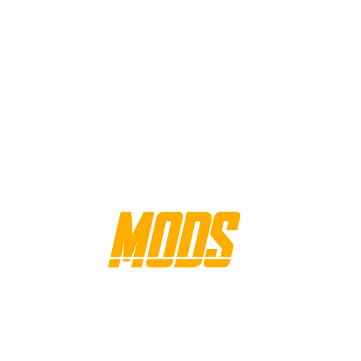

  

<h1 align="center">Marvel Rivals Mod Manager</h1>

  
  

Mod manager for Marvel Rivals. Windows only.

## Download

Installer is on the [releases page](https://github.com/chr0wmiee/rivals-mod-manager/releases/latest).

## What it does

- Drag mods in and they install
- Browse and download from Nexus without leaving the app
- Keeps a copy of every mod so game updates don't wipe them
- Works out what a mod is and who it's for
- Presets for swapping between mod setups
- Look at textures, sounds and models before installing anything
- Sound replacement tool
- Updates itself

## License

MIT
